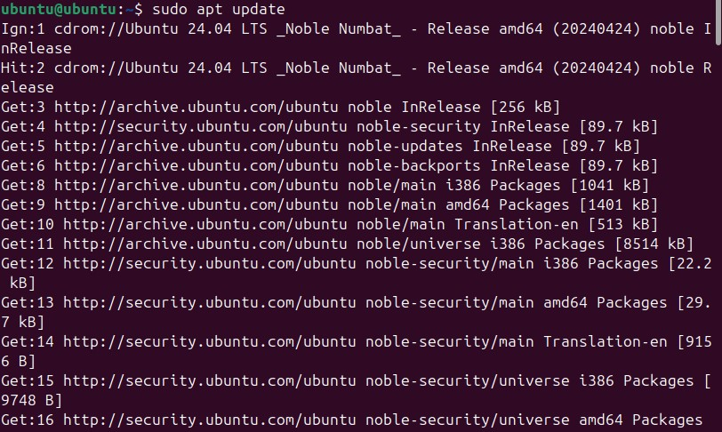
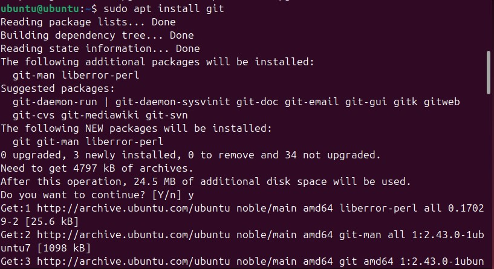
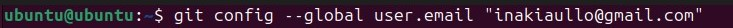
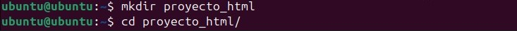
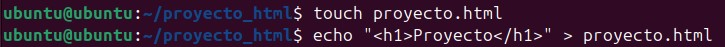
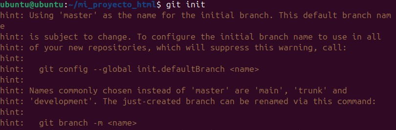
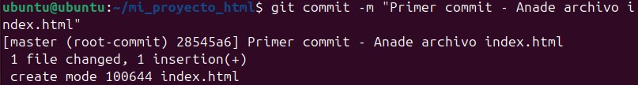
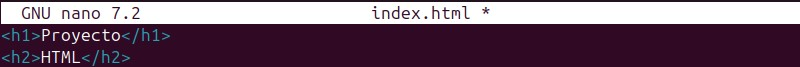

# Cómo Utilizar Git en un Proyecto

## Motivación
Git es una herramienta poderosa para el control de versiones que te permite llevar un seguimiento detallado de los cambios en tus archivos a lo largo del tiempo. Utilizar Git en tu proyecto localmente te permite:
- **Mantener un historial de cambios:** Puedes ver qué se cambió, cuándo y por quién.
- **Facilitar la colaboración:** Git hace que trabajar en equipo sea más eficiente al manejar múltiples contribuciones sin conflictos.
- **Deshacer errores:** Si algo sale mal, puedes revertir cambios y recuperar versiones anteriores de tus archivos.

## Instalación de Git
Para instalar Git en un sistema Ubuntu sin Git instalado, sigue estos pasos:

1. **Actualiza los paquetes del sistema:**
    ```bash
    sudo apt update
    ```

2. **Instala Git:**
    ```bash
    sudo apt install git
    ```

3. **Configura tu nombre y email:**
    ```bash
    git config --global user.name "Inaki"
    git config --global user.email "inakiaullo@educacion.navarra.es"
    ```


## Estructura del Proyecto
Vamos a crear un proyecto muy básico de HTML. Esto incluye la creación de un directorio y un archivo.

1. **Crea un directorio para tu proyecto:**
    ```bash
    mkdir mi_proyecto_html
    cd mi_proyecto_html
    ```

2. **Crea un archivo HTML básico:**
    ```bash
    echo "<h1>Proyecto</h1>" > index.html
    ```

## Inicialización del Repositorio Git
Dentro del directorio de tu proyecto, inicializa un repositorio de Git.

1. **Inicializa Git:**
    ```bash
    git init
    ```
    

2. **Agrega el archivo a Git:**
    ```bash
    git add index.html
    ```

3. **Crea el primer commit:**
    ```bash
    git commit -m "Primer commit - Añade archivo index.html"
    ```

## Flujo de Trabajo


1. **Edita el archivo HTML:**
    ```bash
    nano index.html
    ```

2. **Agrega y confirma los cambios:**
    ```Una vez hemos echo los cambios, hacemos "ctrl + o" luego "enter", y por ultimo "ctrl + x" , y de esa manera guardamos los cambios en el archivo
    ```

## Enlaces de Interés
- [Documentación oficial de Git](https://git-scm.com/doc)
- [Tutorial interactivo de Git](https://learngitbranching.js.org/)

## Bibliografía
1. [Pro Git Book](https://git-scm.com/book/en/v2) - Un recurso completo sobre Git.
2. [Git Cheat Sheet](https://education.github.com/git-cheat-sheet-education.pdf) - Una hoja de referencia rápida para los comandos de Git.

